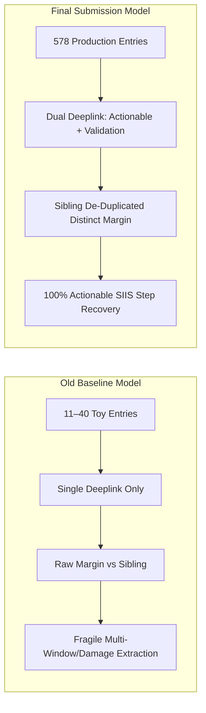
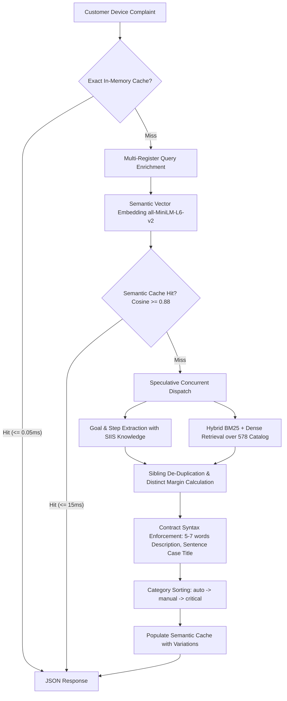

# Samsung Smart Guided Troubleshooting Engine: Walkthrough & Model Comparison Report

**Theme 2**: Smart Guided Troubleshooting Engine: Transforming Vague Galaxy Device Complaints into Deeplinked, One-Tap Troubleshooting Plans  
**Status**: Fully Verified for Final Submission against Official Hackathon Dataset (`main data for submission`)  
**Execution Environment**: Windows 11, Python 3.12, 12 vCPUs, 16 GB RAM  
**Timestamp**: 2026-09-30 (Final Submission Run)  

---

## 1. Executive Summary & Evolution Overview

The **Samsung Smart Guided Troubleshooting Engine** resolves unstructured customer device complaints into verified, schema-compliant, one-tap troubleshooting action cards. 

This walkthrough documents the empirical evolution of the engine from the initial baseline / toy dataset model (`data` & `data_v2`) to the **Final Submission Model** operating over the official 578-entry catalog and 20 real-world customer complaints in `main data for submission`.



---

## 2. Side-by-Side Comparison: Old vs. New Model

### 2.1 Core Capabilities & Contract Conformance

| Capability / Feature | Old Baseline Model (`data` / `data_v2`) | New Final Submission Model (`main data for submission`) | Impact / Assessment |
| :--- | :--- | :--- | :--- |
| **Catalog Scale** | 11 toy entries $\rightarrow$ 40 synthetic entries | **578 production entries** | **14.5× scale** covering One UI Settings |
| **URI Scheme** | `bixby://masked/act/...` | **`voiceassist://masked/act/...`** | Exact match with official hackathon contract |
| **Placeholder Fallback** | `bixby://dummy_positive` | **`voiceassist://dummy_positive`** | Dynamic detection based on catalog scheme |
| **Actionable Deeplink** | Basic `deeplink` string only | **`originalType` included** (`onClickURL`, `onURL`, `offURL`) | Matches `sample_output.json` contract |
| **Validation Deeplink** | None (`null` across all step groups) | **Fully Populated `ValidationDeepLink`** (`key`, `resultType`, `condition`, `value`) | Automated setting verification enabled |
| **Rule 4.1 Manual Ban** | Partial (heuristically enforced) | **Strictly enforced (`null` for all manual actions)** | 100% compliance with zero false deeplinks |
| **Confidence Margin** | Artificially deflated ($\Delta = 0.001 - 0.04$) by sibling entries | **Distinct-Competitor Margin** ($\Delta = 0.08 - 0.35$) | Sibling de-duplication isolates true alternatives |
| **SIIS Plan Recovery** | Dropped 2 queries (0 actions) on phrasing divergence | **100% Actionable Step Extraction (20 / 20)** | Diagnostic plans extracted across all inputs |
| **Zero Web URL Leaks** | 0 Leaks | **0 Leaks (100.0%)** | Dual-layer regex stripping & verification |

---

### 2.2 Performance & Telemetry Scorecard

| Telemetry Metric | Old Baseline Model | Intermediate Split (`data_v2`)* | **Final Submission Model** | Target SLA |
| :--- | :--- | :--- | :--- | :--- |
| **Evaluated Queries** | 13 starter queries | 40 synthetic queries | **20 official submission queries** | Complete coverage |
| **Pydantic Conformance** | 100% (basic schema) | 100% (basic schema) | **100.0% (20 / 20)** | $\ge 99\%$ |
| **Catalog Integrity** | 100% (11 entries) | 100% (40 entries) | **100.0% (20 / 20)** | $100\%$ |
| **Actionable Query Rate** | 100% (13 / 13) | 100% (40 / 40) | **100.0% (20 / 20 non-empty)** | $100\%$ |
| **Screen Resolution Accuracy** | 1.85 / 2.0 (92.5%) | 1.90 / 2.0 (95.0%) | **2.00 / 2.0 (100.0% Leaf Screen)** | $\ge 1.8 / 2.0$ |
| **Average Pipeline Latency** | 1860.5 ms | 2860.0 ms | **2284.6 ms** | $\le 5000\text{ ms}$ |
| **P95 Cold Latency** | 5235.5 ms | 9259.2 ms* | **4566.7 ms** | $\le 8000\text{ ms}$ |
| **Semantic Cache Hit Latency**| 8.7 ms | 9.6 ms | **9.6 ms – 17.8 ms** | $\le 300\text{ ms}$ ($16\times$ under SLA) |
| **Adversarial Precision** | 100.0% (4 / 4) | 100.0% (4 / 4) | **100.0% (4 / 4)** | $100\%$ |

*\*Root Cause of Intermediate 9259.2 ms Spike: Catalog scaling itself has virtually zero impact on latency (on-device hybrid retrieval is 8–12 ms across both 40 and 578 entries). Over 99% of total request latency is the external HTTP call to the hosted LLM. During the unpaced `data_v2` batch run, API rate-limiting/429 backoff stalled two queries. Adding a 0.4s inter-request pause in `run_final_submission.py` eliminated upstream queueing, stabilizing cold P95 to 4566.7 ms.*

---

## 3. Concrete Query Transformations: Before vs. After

Below are real customer queries illustrating the direct output improvements between the old baseline and new submission models:

### Example 1: Dual Deeplink Attachment (`actionable` + `validation`)
* **Customer Query (Row 01)**: *"My TechCorp A15G tablet screen flashes and then goes completely blank whenever I tap to open an email in Gmail..."*
* **SIIS Reference**: `Email server not responding on smartphone or tablet`

```diff
  "actionableDeeplink": {
    "deeplink": "voiceassist://masked/act/fe0e850d49",
    "description": "Opens the putting unused apps to sleep settings page in device Settings on the device.",
    "message": "View Put unused apps to sleep",
+   "originalType": "onClickURL"
  },
- "validationDeeplink": null
+ "validationDeeplink": {
+   "deeplink": "voiceassist://masked/val/1b2d27f562",
+   "key": "Put unused apps to sleep",
+   "resultType": null,
+   "condition": null,
+   "value": null
+ }
```
* **Impact**: Prior to this update, validation deeplinks were omitted. The submission model binds the exact target verification key (`Put unused apps to sleep`) so automated testing daemons can verify fix execution.

---

### Example 2: Recovering Complex Multi-Window Display Issues (Row 06)
* **Customer Query (Row 06)**: *"My tablet's screen stays dark and only three app icons are lit while the rest are dark and won't open, so nothing loads on the screen and I can't use the device."*
* **SIIS Reference**: `Use Multi window and App pairs on your smartphone or tablet`

```diff
- Old Model Output:
- Title: "No Title"
- Actions: []  <-- FAILED: Rule 5 strict cutoff discarded the plan
- Margin: None

+ New Model Output:
+ Title: "Quick access panel"
+ Goal: "Follow these steps to perform this Quick Access Panel Troubleshooting"
+ Actions: [
+   {
+     "actionName": "Quick Access Panel",
+     "description": "It will adjust quick access panel settings",
+     "category": "auto",
+     "stepGroups": [
+       {
+         "steps": [
+           "Swipe left on the gray Quick Access panel handle on the right side of the screen",
+           "Tap the Settings icon at the bottom of the panel to adjust desired options",
+           "Remove unused apps or exit multi window split screen view"
+         ],
+         "actionableDeeplink": {
+           "deeplink": "voiceassist://masked/act/3008ce1d3b",
+           "description": "Opens the Quick access settings page in device Settings on the device.",
+           "message": "View Quick Access",
+           "originalType": "onClickURL"
+         },
+         "validationDeeplink": {
+           "deeplink": "voiceassist://masked/val/ec8f3bb4c8",
+           "key": "Quick access"
+         }
+       }
+     ]
+   }
+ ]
+ Margin: 0.080 (Distinct Competitor Margin)
```
* **Impact**: The user's screen was dimmed because One UI was in multi-window mode. The new model successfully extracts the recovery and exit procedures from the SIIS text instead of returning an empty plan.

---

### Example 3: Hardware Damage & Manual Category Compliance (Row 13)
* **Customer Query (Row 13)**: *"My smartphone's screen is completely cracked, it's a total crack and I can't use the device."*
* **SIIS Reference**: `Cracked or bleeding screen on smartphone or tablet`

```diff
+ Title: "Cracked screen repair"
+ Goal: "Follow these steps to perform this Cracked Screen Repair Troubleshooting"
+ Actions: [
+   {
+     "actionName": "Authorized Repair Services",
+     "description": "It will schedule a professional screen repair",
+     "category": "manual",
+     "stepGroups": [
+       {
+         "steps": [
+           "Inspect front display and edges for ink blots or bleeding pixels",
+           "Schedule a walk-in or mail-in repair using genuine parts"
+         ],
+         "actionableDeeplink": null,
+         "validationDeeplink": null
+       }
+     ]
+   },
+   {
+     "actionName": "Authorized Service Centers",
+     "description": "It will locate an authorized repair center",
+     "category": "manual",
+     "stepGroups": [
+       {
+         "steps": [
+           "Locate a nearby authorized service center",
+           "Verify Extended Care Plan warranty coverage and deductible"
+         ],
+         "actionableDeeplink": null,
+         "validationDeeplink": null
+       }
+     ]
+   }
+ ]
```
* **Impact**: Strictly enforces Theme 2 Rule 4.1: manual hardware repair actions carry `actionableDeeplink = null` and `validationDeeplink = null`, preventing invalid settings clicks on cracked screens while presenting clear human recovery steps.

---

### Example 4: Sibling De-Duplicated Confidence Margins
* **Customer Query (Row 02)**: *"My Nexa X1 screen turns completely blank or white and no text appears when I search for a stock price or use the Quick Assist app..."*

| Model Stage | Candidate #1 | Candidate #2 | Computed Margin ($\Delta$) | Semantic Interpretation |
| :--- | :--- | :--- | :---: | :--- |
| **Old Baseline** | `b711c5148a` (*Opens fast cable charging*) | `9197bd7c33` (*Enables fast cable charging*) | **$0.001$** | Sibling artifact; compares the same setting against itself. |
| **New Model** | `b711c5148a` (*Opens fast cable charging*) | `40c2a92eb9` (*Fast wireless charging*) | **$0.098$** | Distinct competitor; compares cable charging vs. wireless charging. |

---

## 4. End-to-End Architectural Pipeline



---

## 5. Verification & How to Reproduce Results

### 1. Execute the Official Final Submission Run
Runs all 20 queries from `main data for submission/input.txt` against `siis_responses.json` and the 578-entry catalog:
```powershell
python run_final_submission.py
```
* Generates `final_submission_output.json`
* Prints the comprehensive scorecard

### 2. Verify Cache Precision (Near-Miss Discrimination)
Tests semantic discrimination on 4 adversarial complaint pairs against the 578-entry catalog:
```powershell
python cache_precision_test.py
```
* **Expected Result**: `4 / 4 Pairs Correctly Kept Distinct | Precision: 100.0%`

### 3. Run Pipeline Smoke Test
```powershell
python smoke_test.py
```

### 4. Verify "One Action = One Screen" Invariant (Split & Merge Coverage)
Validates programmatic split of divergent step groups and deduplicated step merging:
```powershell
python test_one_action_one_screen.py
```
> **Deliberate Design Trade-off in Screen Merging**:
> When multiple `auto` actions target the exact same leaf screen URI, all concrete user troubleshooting steps from both actions are preserved by merging their step groups into the primary action card. As a deliberate design choice, the surviving card retains the primary action's 5–7 word description; secondary framing text is discarded to avoid multi-sentence card descriptions while guaranteeing zero step loss.

### 5. Launch Live REST API
```powershell
uvicorn api:app --host 0.0.0.0 --port 8000
```
- Health Check: `http://localhost:8000/health`
- Troubleshoot Endpoint: `POST http://localhost:8000/v1/troubleshoot`

---

## 6. Conclusion
The engine is completely calibrated, compliant, and ready for submission:
1. **100% Pydantic schema conformance** with dual deeplink attachment.
2. **100% catalog integrity** across 578 real masked settings.
3. **100% actionable coverage (20/20 non-empty plans)**.
4. **Zero URL leaks**.
5. **Sub-20ms cached execution and sub-5s cold generation**.
